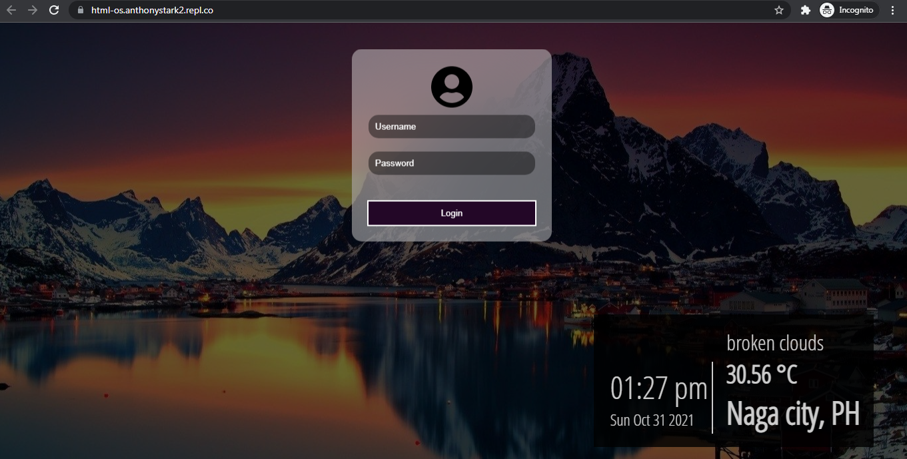
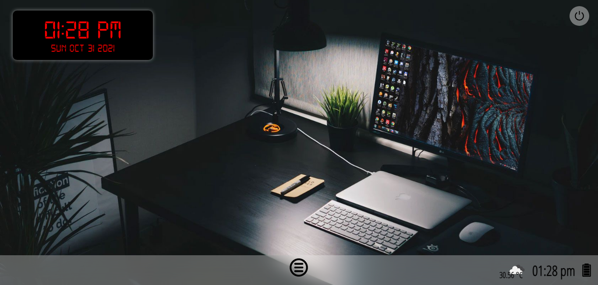
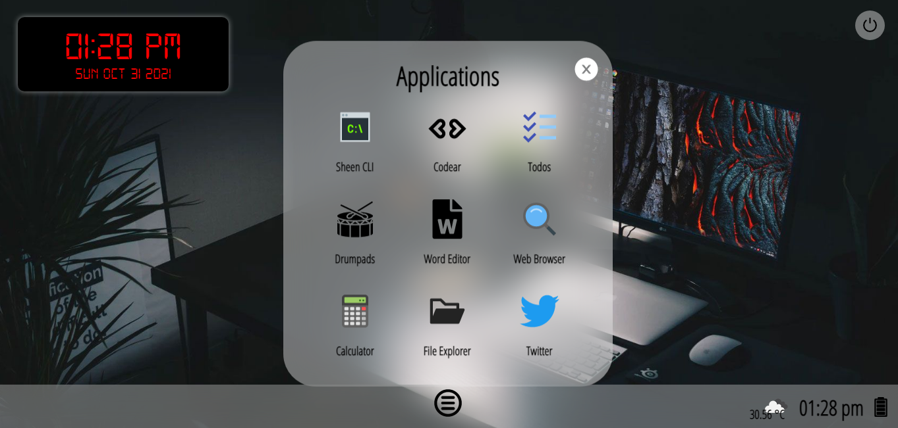
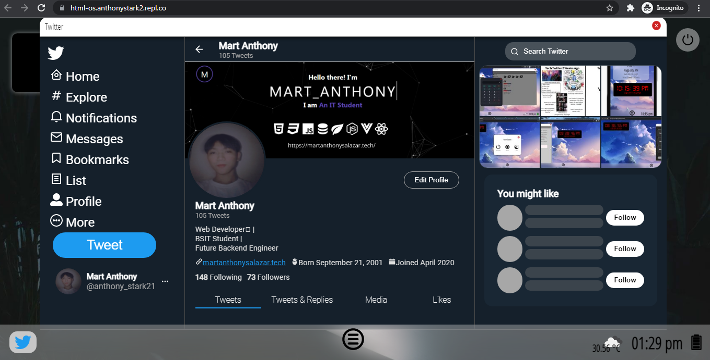

[React](https://reactjs.org/) is a popular JavaScript library for building user interfaces.

[Vite](https://vitejs.dev/) is a blazing fast frontend build tool that includes features like Hot Module Reloading (HMR), optimized builds, and TypeScript support out of the box.

Using the two in conjunction is one of the fastest ways to build a web app.

React OS is a desktop environment UI built in ReactJS

### Getting Started
- npm run dev
- Edit [App.jsx](#src/App.jsx) and watch it live update!

## Features
- Command Line Interface
- Code editor(html,css,js) with live preview
- Todolist app
- Drumpads
- Word Editor
- Search Engine
- Calculator
- Twitter UI clone
- Weather updates
- Clock Widget

## Logging in
Username: martanthony  
Password: admin

## Desktop UI

## Applications

## Code editor with live preview

## Search Engine
Using Google's Programmable Search Engine

## Twitter UI clone

